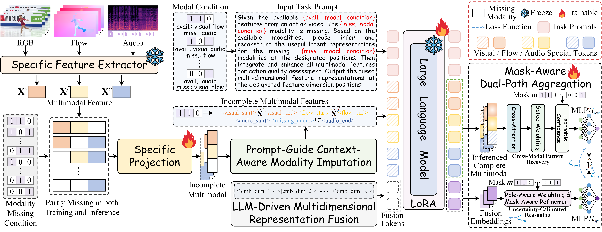

# LIMSSR
[ICML'26 Spotlight] Code for ''LIMSSR: LLM-Driven Sequence-to-Score Reasoning under Training-Time Incomplete Multimodal Observations''

## Abstract
Real-world multimodal learning is often hindered by missing modalities. While Incomplete Multimodal Learning (IML) has gained traction, existing methods typically rely on the unrealistic assumption of full-modal availability during training to provide reconstruction supervision or cross-modal priors. This paper tackles the more challenging setting of IML under training-time incomplete observations, which precludes reliance on a ``God's eye view'' of complete data. We propose LIMSSR (LLM-Driven Incomplete Multimodal Sequence-to-Score Reasoning), a framework that reformulates this challenge as a conditional sequence reasoning task. LIMSSR leverages the semantic reasoning capabilities of Large Language Models via Prompt-Guided Context-Aware Modality Imputation and Multidimensional Representation Fusion to infer latent semantics from available contexts without direct reconstruction. To mitigate hallucinations, we introduce a Mask-Aware Dual-Path Aggregation to dynamically calibrate inference uncertainty. Extensive experiments on three Action Quality Assessment datasets demonstrate that LIMSSR significantly outperforms state-of-the-art baselines without relying on complete training data, establishing a new paradigm for data-efficient multimodal learning.



## Environments

- RTX 3090
- CUDA: 12.2
- Python: 3.9.23
- PyTorch: 2.4.1+cu124
- peft: 0.17.1

## Dataset Preparation
### Features

The features (RGB, Audio, Flow) and label files of Rhythmic Gymnastics and Fis-V dataset can be downloaded from the [PAMFN](https://github.com/qinghuannn/PAMFN) repository.

The features (RGB, Audio) and label files of FS1000 dataset can be downloaded from the [Skating-Mixer](https://github.com/AndyFrancesco29/Audio-Visual-Figure-Skating) repository. We adopt the same frame sampling method to extract Optical Flow features from the FS1000 dataset, which can be downloaded via this [link](https://1drv.ms/f/c/056e0e22eb875f5c/IgAq1rrVu9n_Rqd2CaYr00ADAcpMRjh4Tf_gmX3yUsYIFEc?e=g9rFJf).

### Datasets Structure
You can place the corresponding datasets according to the following structure:

```
$DATASET_ROOT
├── FS1000
    ├── output_feature_fs1000_new
        ├── 2018_Final_MF_Junhwan.npy
        ...
        └── 2021_R_PF_7.npy
    ├── ast_feature_fs1000_new
        ├── 2018_Final_MF_Junhwan.npy
        ...
        └── 2021_R_PF_7.npy
    ├── i3d_avg_clip8_5s_fs1000
        ├── 2018_Final_MF_Junhwan.npy
        ...
        └── 2021_R_PF_7.npy
    ├── train_fs1000_new.txt
    └── val_fs1000_new.txt
├── Fis-V
    ├── Fis-feature
        ├── FISV_audio_AST.npy
        ├── FISV_flow_I3D.npy
        └── FISV_rgb_VST.npy
    ├── train.txt
    └── test.txt
└── RG
    ├──RG-feature
        ├── Ball_audio_AST.npy
        ├── Ball_flow_I3D.npy
        ...
        └── Ribbon_rgb_VST.npy
    ├── train.txt
    └── test.txt
```

## Running
### Please fill in or select the args enclosed by {} first.
Specific commands are coming soon.