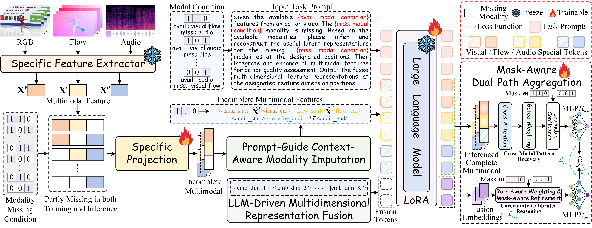

# LIMSSR
**[ICML'26 Spotlight (Top-2.2%)]** Code for ''LIMSSR: LLM-Driven Sequence-to-Score Reasoning under Training-Time Incomplete Multimodal Observations''

## Abstract
Real-world multimodal learning is often hindered by missing modalities. While Incomplete Multimodal Learning (IML) has gained traction, existing methods typically rely on the unrealistic assumption of full-modal availability during training to provide reconstruction supervision or cross-modal priors. This paper tackles the more challenging setting of IML under training-time incomplete observations, which precludes reliance on a ``God's eye view'' of complete data. We propose LIMSSR (LLM-Driven Incomplete Multimodal Sequence-to-Score Reasoning), a framework that reformulates this challenge as a conditional sequence reasoning task. LIMSSR leverages the semantic reasoning capabilities of Large Language Models via Prompt-Guided Context-Aware Modality Imputation and Multidimensional Representation Fusion to infer latent semantics from available contexts without direct reconstruction. To mitigate hallucinations, we introduce a Mask-Aware Dual-Path Aggregation to dynamically calibrate inference uncertainty. Extensive experiments on three Action Quality Assessment datasets demonstrate that LIMSSR significantly outperforms state-of-the-art baselines without relying on complete training data, establishing a new paradigm for data-efficient multimodal learning.



## Environments

- RTX 3090
- CUDA: 12.2
- Python: 3.9.23
- PyTorch: 2.4.1+cu124
- peft: 0.17.1

## Dataset Preparation
### Features

The features (RGB, Audio, Flow) and label files of Rhythmic Gymnastics and Fis-V dataset can be downloaded from the [PAMFN](https://github.com/qinghuannn/PAMFN) repository.

The features (RGB, Audio) and label files of FS1000 dataset can be downloaded from the [Skating-Mixer](https://github.com/AndyFrancesco29/Audio-Visual-Figure-Skating) repository. We adopt the same frame sampling method to extract Optical Flow features from the FS1000 dataset, which can be downloaded via this [link](https://1drv.ms/f/c/056e0e22eb875f5c/IgAq1rrVu9n_Rqd2CaYr00ADAcpMRjh4Tf_gmX3yUsYIFEc?e=g9rFJf).

### Datasets Structure
You can place the corresponding datasets according to the following structure:

```
$DATASET_ROOT
├── FS1000
    ├── output_feature_fs1000_new
        ├── 2018_Final_MF_Junhwan.npy
        ...
        └── 2021_R_PF_7.npy
    ├── ast_feature_fs1000_new
        ├── 2018_Final_MF_Junhwan.npy
        ...
        └── 2021_R_PF_7.npy
    ├── i3d_avg_clip8_5s_fs1000
        ├── 2018_Final_MF_Junhwan.npy
        ...
        └── 2021_R_PF_7.npy
    ├── train_fs1000_new.txt
    └── val_fs1000_new.txt
├── Fis-V
    ├── Fis-feature
        ├── FISV_audio_AST.npy
        ├── FISV_flow_I3D.npy
        └── FISV_rgb_VST.npy
    ├── train.txt
    └── test.txt
└── RG
    ├──RG-feature
        ├── Ball_audio_AST.npy
        ├── Ball_flow_I3D.npy
        ...
        └── Ribbon_rgb_VST.npy
    ├── train.txt
    └── test.txt
```

## LLM Backbone
You can follow the official [Qwen3](https://huggingface.co/Qwen/Qwen3-0.6B) tutorial to obtain the Qwen3-0.6B model.

## Running
### Please fill in or select the args enclosed by {} first.
On the **FS1000** dataset:

- Training

```
CUDA_VISIBLE_DEVICES={device ID} python main.py --video-path {path of video features} --audio-path {path of audio features} --flow-path {path of flow features} --train-label-path {path of label file of training set} --test-label-path {path of label file of test set} --model-name {the name used to save model and log} --action-type {TES/PCS/SS/TR/PE/CO/IN} --dataset FS1000 --clip-num 95 --epoch {160/100/130/90/130/200/290}  --lr 2e-4 --lr-decay cos --decay-rate 0.1 --dropout 0.15

Additional Arguments:
PCS: --alpha_mse 1
TR:  --alpha_con 10
PE:  --alpha_mse 1
CO:  --alpha_con 10
IN:  --alpha_mse 1 --alpha 0.5
```

- Testing

```
CUDA_VISIBLE_DEVICES={device ID} python main.py --video-path {path of video features} --audio-path {path of audio features} --flow-path {path of flow features} --train-label-path {path of label file of training set} --test-label-path {path of label file of test set} --action-type {TES/PCS/SS/TR/PE/CO/IN} --dataset FS1000 --clip-num 95 --test --ckpt {the name of the used checkpoint}
```

On the **FisV** dataset:

- Training

```
CUDA_VISIBLE_DEVICES={device ID} python main.py --video-path {path of video features} --audio-path {path of audio features} --flow-path {path of flow features} --train-label-path {path of label file of training set} --test-label-path {path of label file of test set} --model-name {the name used to save model and log} --action-type {TES/PCS} --dataset FisV --clip-num 124 --epoch {270/140} --lr 2e-4 --lr-decay cos --decay-rate 0.1 --dropout 0.15
```

- Testing

```
CUDA_VISIBLE_DEVICES={device ID} python main.py --video-path {path of video features} --audio-path {path of audio features} --flow-path {path of flow features} --train-label-path {path of label file of training set} --test-label-path {path of label file of test set} --action-type {TES/PCS} --dataset FisV --clip-num 124 --test --ckpt {the name of the used checkpoint}
```

On the **RG** dataset:

- Training

```
CUDA_VISIBLE_DEVICES={device ID} python main.py --video-path {path of video features} --audio-path {path of audio features} --flow-path {path of flow features} --train-label-path {path of label file of training set} --test-label-path {path of label file of test set} --model-name {the name used to save model and log} --action-type {Ball/Clubs/Hoop/Ribbon} --dataset RG --clip-num 68 --epoch {80/410/100/270} --lr 2e-4 --lr-decay cos --decay-rate {0.1/0.1/0.01/0.1} --dropout {0.35/0.35/0.3/0.35}

Additional Arguments:
Ball:  --seed 6
Clubs: --alpha 2 --seed 113
Hoop:  --alpha_con 2
```

- Testing

```
CUDA_VISIBLE_DEVICES={device ID} python main.py --video-path {path of video features} --audio-path {path of audio features} --flow-path {path of flow features} --train-label-path {path of label file of training set} --test-label-path {path of label file of test set} --action-type {Ball/Clubs/Hoop/Ribbon} --dataset RG --clip-num 68 --test --ckpt {the name of the used checkpoint}
```

**Please note! During training, we save the model that performs best in complete multimodal scenarios. Then, during testing, we evaluate this model across all incomplete multimodal scenarios. Additionally, we save both the model with the best SP. Corr. metric and the model with the best MSE metric, then select the model that achieves better overall balance across all settings. You can modify the code based on your specific application and select the optimal model for your needs.**

Be patient and persistent in tuning the code to achieve new state-of-the-art results.

## Model Weights
You can download our model weights for each dataset [here](https://huggingface.co/Biubiu95/LIMSSR-Weights).

## Citation
If our project is helpful for your research, please consider citing:
```
@article{xu2026limssr,
  title={LIMSSR: LLM-Driven Sequence-to-Score Reasoning under Training-Time Incomplete Multimodal Observations},
  author={Xu, Huangbiao and Wu, Huanqi and Ke, Xiao and Peng, Yuxin},
  journal={arXiv preprint arXiv:2605.00434},
  year={2026}
}

@inproceedings{xu2026mcmoe,
  title={MCMoE: Completing Missing Modalities with Mixture of Experts for Incomplete Multimodal Action Quality Assessment},
  author={Xu, Huangbiao and Wu, Huanqi and Ke, Xiao and Wu, Junyi and Xu, Rui and Xu, Jinglin},
  booktitle={Proceedings of the AAAI Conference on Artificial Intelligence},
  volume={40},
  number={13},
  pages={11241--11249},
  year={2026}
}
```